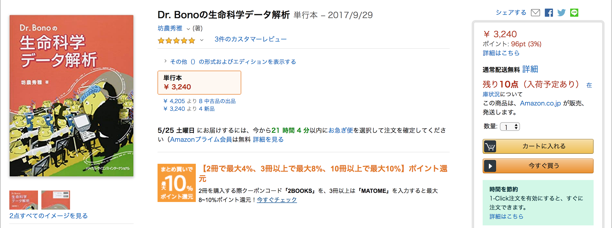

## AJACSa6河内
# 疾患・表現型データベース（Gendoo、OMIM、他）

大学共同利用機関法人 情報・システム研究機構  
データサイエンス共同利用基盤施設  
ライフサイエンス統合データベースセンター
[仲里 猛留](http://data.dbcls.jp/~nakazato/)
nakazato@dbcls.rois.ac.jp
twitter: @chalkless

2019年7月25日（木）
関西医科大学

----

[AJACSa6河内](http://dbcls.rois.ac.jp/ja/2019/06/25/post1.html) > 疾患・表現型データベース（Gendoo、OMIM、他）

----

## さまざまな疾患データベース
- ICD-10
- OMIM
- MedGen
- ...

### ICD-10
- 国際疾病分類（International Classification of Diseases） by WHO
- 日本語化もされている。
- この用語を用いて電子カルテなどの疾患名としている
- 疾患例：[Dyshormogenetic goitre (Pendred syndrome)](https://icd.who.int/browse10/2016/en#/E07.1)
- 同 日本語版：[甲状腺ホルモン合成障害による甲状腺腫](http://www.dis.h.u-tokyo.ac.jp/Scripts/ICD10Categories/default2_ICD.asp?CategoryID=E07.1)
- 疾患名だけ。解説はない。ましてや関連する遺伝子の情報などない

### OMIM
- Online Mendelian Inheritance in Man
- 遺伝性疾患とその原因遺伝子のデータベース
- Dr. McKusick (Johns Hopkins大学) が1960年代より書きためた記録（カタログ）のオンライン版
- https://omim.org/
- もともとOnline版はNCBIから公開していたので https://www.ncbi.nlm.nih.gov/omim/ も使える（が、詳細データは上記にリダイレクトされる）
- 26256件（2019年5月）
- 疾患例：[Pendred syndrome](https://www.omim.org/entry/274600)
- 遺伝子例：[SLC26A4](https://www.omim.org/entry/605646)
- 分子生物学屋は疾患情報のよりどころとしてこれを使う傾向がある
- あくまでも遺伝子による疾患なので、同じphenotypeでも原因遺伝子が違うと別のエントリが立てられていたりする。
  - 2型糖尿病（NIDDM）の他に、NIDDM1, NIDDM2, NIDDM3 など
- 最近、ライセンスが厳しくなった?

### MedGen
- 疾患リソース（データベース、用語集）に外部データを紐付けたりした統合的な症状や表現型のデータベース
- by NCBI
- https://www.ncbi.nlm.nih.gov/medgen/
- 30917件（2019年5月）
- 疾患例：[Pendred syndrome](https://www.ncbi.nlm.nih.gov/medgen/82890)
- FTPサイトにデータが置かれている
- 他データベースのエントリとの変換テーブルも作成されている（OMIM, Geneなど）
- コンピューターで一括処理するには便利そう。閲覧するのも便利?

### Malacards
- 疾患・表現型の統合的なデータベース
- https://www.malacards.org/
- by Weizmann Institute of Science
 (Israel)
- 19941 entries
- GeneCard のシリーズ
- データもダウンロード可能
- インターフェースも綺麗なので閲覧にはよさそう
- ちゃんと永続的に管理してくれればいいのだが。。。

### KEGG Disease
- pathway情報から派生した疾患のデータベース
- https://www.genome.jp/kegg/disease/disease_ja.html
- 疾患から原因遺伝子、その遺伝子に関連するpathwayとたどることが可能
- by 京大・金久研究室
- ライセンスはどうだろうか。。。

### ClinVar
- ヒトvariationと疾患（表現型）のデータベース
- https://www.ncbi.nlm.nih.gov/clinvar/
- by NCBI
- 509259 entries

### Orphanet
- 希少疾患とorphan drugのデータベース
- https://www.orpha.net/
- by Orphanet コンソーシアム（フランス・Insermが中心）
- 5856 diseases and 3573 genes

### PubCaseFinder
- 症状から希少疾患を検索できるウェブサービス
- https://pubcasefinder.dbcls.jp/
- by DBCLS
- 内訳
  - 4066 rare diseases
  - 4002 disease-gene associations
  - 1M+ case reports

### HPO (Human Phenotype Ontology)
- ヒトの表現型についてのオントロジー
  - （疾患による表現型異常）
- https://hpo.jax.org/

### DO (Disease Ontology)
- ヒト疾患のオントロジー
- http://disease-ontology.org/

## 疾患データの活用
### Gendoo
- Gene and Disease features Ontology-based Overview System （の略ということになっています）
- **もともとのMotivation**：マイクロアレイやNGSのデータの生物学的な解釈はGOなどの遺伝子レベルばかりで、疾患や化合物の切り口で解釈したい
- **Method**：ヒト各遺伝子について関連文献を取得し、PubMedの文献に付与された（疾患や化合物などの）MeSHキーワードを抽出、スコアリングすることで、遺伝子を疾患や化合物などの切り口から解釈できるようにした
- **その後のMotivation**：数ある疾患について分子生物学をやっている身としてはどんなものなのかわからないのでどうにかならないか?
- **Method**：各疾患について（今回はOMIMを利用）、PubMedから関連文献を抽出し、MeSHキーワードを抽出、スコアリングすることで、疾患をAnatomy、Biological Phenomenaといった（分子生物学用語の）切り口で（も）解釈できるようにした。
- データ作成フロー詳細
  - 
- 結果例（1型/2型糖尿病）
  - 

### SRA収載のNGSデータの疾患による検索（開発中）
- SRA (Sequence Read Archive)は、DDBJ/EBI/NCBIによるNGSデータのレポジトリサイト（公共データベース）
- DBCLSでもSRA検索サイトを開発しており、将来的にDDBJのサイトをこれで置き換える予定 http://sra.dbcls.jp/
- 検索は普通はキーワードベース。が、いくつかの切り口で検索したい
  - ゲノム、遺伝子発現、メタゲノム、エピゲノムなどの目的
  - Illumina か PacBio か Oxford Nanopore かのプラットフォーム（シーケンサー）
  - 生物種
- Motivation：医学・薬学分野では疾患という切り口から検索したいのでは
- Method：SRAデータのreference欄や、関連文献中からSRA IDを抜き出すことで、各SRAデータの関連文献を対応づけ、文献からMeSHの疾患キーワードを抜き出すことで、各SRAデータを疾患名と対応づける
- 結果例（リスト）
  - 
- 結果例（詳細）
  - 
- [欠点] 文献がないと検索されない。しかし、データ登録者は自由記述で当該データの説明書きをつけるので、それをマイニングすれば疾患の抽出はある程度は可能（もまだやっていない）

## その他、疾患関連の統合TVコンテンツ
### TCGAによる癌公開データのダウンロードと解析
- 統合TV：http://togotv.dbcls.jp/20171214.html
- The Cancer Genome Atlas
- https://www.cancer.gov/about-nci/organization/ccg/research/structural-genomics/tcga
  - https://cancergenome.nih.gov からリダイレクトされる

### COSMICによる癌遺伝子の体細胞変異
- 統合TV：http://togotv.dbcls.jp/20180127.html
- the Catalogue Of Somatic Mutations In Cancer
- https://cancer.sanger.ac.uk/cosmic

### GTEx Portalによるヒト各組織での遺伝子発現量や影響するeQTLの検索
- 統合TV：http://togotv.dbcls.jp/20180101.html
- https://gtexportal.org/

## 参考リソース

### 生命科学データベース・ウェブツール
- 
- 通称：統合TV本
- https://www.amazon.co.jp/dp/4815701431/
- 生命科学データベースやツールの使い方ムービーを提供する統合TVからよりすぐりのコンテンツを本の形で図解

### Dr. Bonoの生命科学データ解析
- 
- 通称：ぼうのう本
- https://www.amazon.co.jp/dp/4895929019/
- バイオインフォマティクスの最近の教科書として歴史からデータの初歩的な取り扱いについて解説

----

[AJACSa6河内](http://dbcls.rois.ac.jp/ja/2019/06/25/post1.html) > 疾患・表現型データベース（Gendoo、OMIM、他）

----
